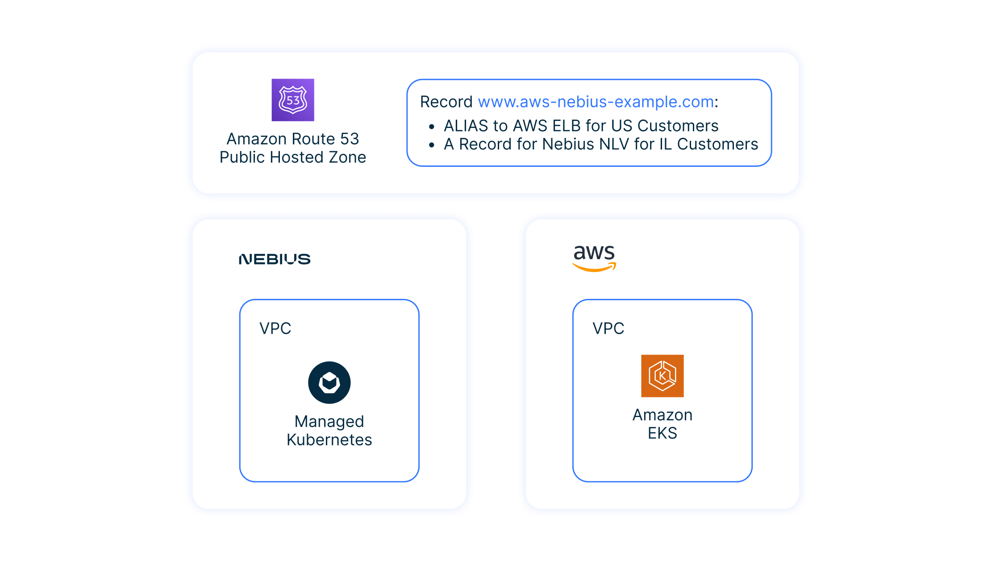

## Overview and target scenario 
This scenario specifically targets customers who have chosen Kubernetes as their base PaaS technology. These customers may have users in regions where AWS doesn't have data centers. To solve this issue, users can deploy a Kubernetes satellite cluster on `Nebius` and add services from their K8S clusters to the Global Service Management system.

For example, in this solution, you can have a main application installed on AWS and a satellite application installed on Nebius. Both applications use Route 53 with regional forwarding, which forwards requests from the US to an AWS site and Local requests to a Nebius site.

<p align="center">
    
</p>


## Prerequisites

- Accounts in AWS and Nebius
- Bash
- Terraform 1.2.8
- curl
- jq

To configure the AWS site:
- Configure the [AWS CLI](https://docs.aws.amazon.com/cli/latest/userguide/cli-chap-configure.html)

To configure the Nebius site:
- Configure [CLI](https://nebius.com/il/docs/cli/quickstart) 
- Export Nebius Credentials to the Terraform Provider

```bash
yc config profile activate default
export CIL_CLOUD_ID=$(yc config get cloud-id)
export CIL_FOLDER_ID=$(yc config get folder-id)
export CIL_TOKEN=$(yc iam create-token)

export TF_VAR_cloud_id=$CIL_CLOUD_ID
export TF_VAR_folder_id=$CIL_FOLDER_ID
export TF_VAR_token=$CIL_TOKEN
```

## Quick start

### Configure your public DNS domain name

Specify value for `aws_domain_name` variable at [variables.tf](example/variables.tf) file.

### Initiate an example playbook 

Please note that this uses the path `~/.ssh/id_rsa.pub` for SSH public key. 
You can change it in [variables.tf](./example/variables.tf)

```bash
cd example
terraform init
terraform apply
```

and wait about 15 minutes.


### Check the result

You can run curl for both pods deployed in multiple clusters:

```bash
curl $(terraform output -raw cil_lb_ip)
curl $(terraform output -raw eks_lb_ip)
```

Check if the Route 53 Global DNS is working:

1) Go to the **AWS Console**.
2) Choose **Route 53 Service**.
3) Choose **aws-nebius-example.com**. (your public DNS name)
4) Click **Test Connection**.

Test the WWW record from different resolver addresses:

1) You can use an Google DNS IP address to emulate US / EU client: `8.8.8.8`
2) You can use an IP address of DNS server from the [list](https://public-dns.info/nameserver/il.html) to emulate Local client.


### Destroy everything quickly

```bash
terraform destroy
```

If destroy operation will fail for some reason, just repeat `terraform destroy` operation again.
