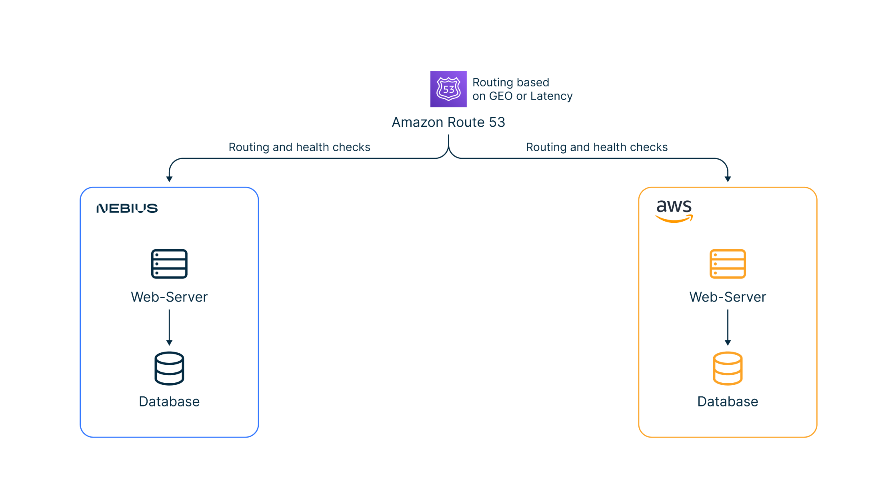
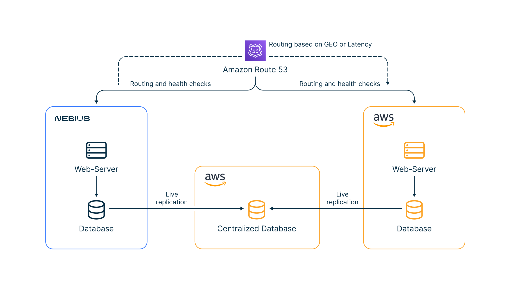
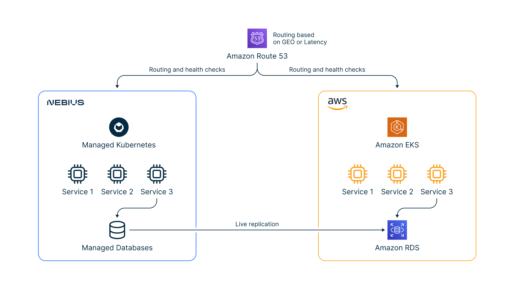
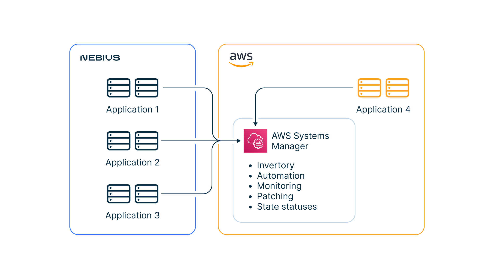

# Nebius Solutions Library for AWS

This repository contains a number of building blocks that will help developers and DevOps engineers build multi-cloud solutions between clouds. We at Nebius tried to identify the most common tasks that developers encounter while architecting or developing solutions, described the best practices, and provided examples of automation using Terraform for building blocks. The repository contains descriptions of common scenarios and consists of the following modules:

* [Example of VPN connection between Nebius and AWS clouds](./VPN/)
* [Example of database replication between managed PostgreSQL and AWS RDS using logical replication](./Database-Replication/)
* [Guide for writing an application on Nebius that is compatible with AWS DynamoDB](./DynamoDB-and-YDB/)
* [Example of Kubernetes deployment between clouds and traffic routing using a global DNS](./Kubernetes-and-Route53/)
* [Example and automation for managing instances on Nebius using AWS Systems Manager](./Multi-Cloud-Management)

We are always open to new ideas for adding blocks to the repository. 
If you think we missed something, please contact us and describe your scenario in the GitHub repository under Issues.

## Why we did it
Organizations often have tens, hundreds and more applications in their IT environments. These applications run in a diverse infrastructure with data centers, hosting environments and branch offices and may also run in multi-cloud scenarios. Regulations in many countries require keeping certain data within the physical borders of those particular countries. Adding to this complexity, customers also use different development tools, languages and frameworks as well as technologies like DevOps, Kubernetes and Data Platform. Organizations need a solution to architect, design, and manage hybrid applications and infrastructure where components are distributed across public cloud services, private clouds, data-centers and edge locations without sacrificing central visibility and control.

To address these scenarios, we decided to implement best practices and automation techniques to help bootstrap development and deployment. Below you’ll find some common architecture patterns that can be developed using the integration block examples in this repository, among other things.

## Scenarios
* [Website with Independent deployment and Global routing](#ch1)
* [Website with Dependent or Centralized databases](#ch2)
* [Kubernetes applications on Multi-Cloud](#ch3)
* [Centralized virtual machine fleet management](#ch4)

### **Website with Independent deployment and Global routing** 
This is an example of a website that works independently on both clouds to be closer to end 
users and compliant with local private data laws and regulations. 

Routing is established by a global DNS via [Amazon Route 53](https://aws.amazon.com/route53/), which can route users based on their location or latency.

    

An example of setting up Route 53 between Nebius and AWS can be found [here](./Kubernetes-and-Route53/).

### **Website with Dependent or Centralized databases** 
This is a more advanced scenario that requires you to collect data in a centralized location for further analysis or analytics.

    

Examples of such type architecture:
* [Setting up replication between databases based on PostgreSQL](./Database-Replication/)
* [Establishing a VPN connection for more secure connectivity](./VPN/)

### **Kubernetes applications on Multi-Cloud** 
Kubernetes is an extremely popular technology for building apps. 
This scenario shows how you can build a distributed app based on Kubernetes. 
The state of the app in the database can be synced. 

You can enhance this architecture to establish a federation of Kubernetes resources between clusters using 
[KubeFed](https://github.com/kubernetes-sigs/kubefed) or [Istio](https://istio.io/).

    

Examples of such type architecture:
* [Kubernetes deployment between clouds and traffic routing using global DNS](./Kubernetes-and-Route53/)
* [Setting up replication between databases based on PostgreSQL](./Database-Replication/)
* [Establishing a VPN connection for more secure connectivity](./VPN/)
* [KubeFed Examples](https://github.com/kubernetes-sigs/kubefed/tree/master/example)

### **Centralized virtual machine fleet management** 
In some cases, apps can work completely independently and you don’t need to sync states 
or data between deployment sites. However, you still need to operate and manage these apps 
and virtual machines. 

Management tasks can include:
* Inventory management
* Monitoring
* Patching
* Access control
* etc

    

Examples of such type architecture:
* [Managing instances on Nebius using AWS Systems Manager](./Multi-Cloud-Management/)
* [Establishing a VPN connection for more secure connectivity](./VPN/)
