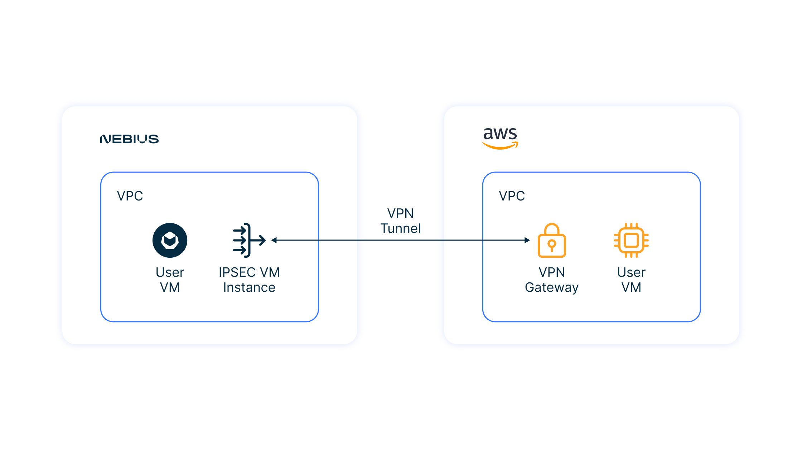

# Setting up a VPN between Nebius VPC and AWS VPC

## Overview and target scenario
If you need to deploy a Site-to-Site VPN connection between Nebius and AWS, you can use this example and module to set it up.


<p align="center">
    
</p>


Let’s look at an example to see how it works.

## Prerequisites

- Accounts in AWS and Nebius
- Bash
- Terraform 1.1.5
- jq

Configure the AWS site:
- Configure the [AWS CLI](https://docs.aws.amazon.com/cli/latest/userguide/cli-chap-configure.html)

Configure the Nebius site:
- Configure [CLI](https://nebius.com/il/docs/cli/quickstart) 
- Export Nebius Credentials to the Terraform Provider

```bash
yc config profile activate default
export CIL_CLOUD_ID=$(yc config get cloud-id)
export CIL_FOLDER_ID=$(yc config get folder-id)
export CIL_TOKEN=$(yc iam create-token)

export TF_VAR_cloud_id=$CIL_CLOUD_ID
export TF_VAR_folder_id=$CIL_FOLDER_ID
export TF_VAR_token=$CIL_TOKEN
```

## Quick start

### Initiate an example playbook  

Please note that this uses the path "~/.ssh/id_rsa.pub" for public keys: 

```bash
cd example
terraform init
terraform apply
```

### Wait about 10 minutes

Afterwards, you should be able to connect to the user’s virtual machines with your SSH key and ping opposite site via VPN tunnel.

You can see how Terraform will checking IPSEC VPN tunnel status and performing end-to-end connectivity tests.


### Ping from Nebius to AWS

You can check end-to-end connectivity by yourself:
```bash
AWS_VM_IP=$(terraform output -raw aws_vm_internal_ip)
CIL_VM_IP=$(terraform output -raw cil_vm_internal_ip)
CIL_SGW_IP=$(terraform output -raw cil_sgw_public_ip)

ssh -J admin@$CIL_SGW_IP admin@$CIL_VM_IP "ping $AWS_VM_IP -c 8"
```

The output should look something like this:
```
Warning: Permanently added 'x.x.x.x' (ECDSA) to the list of known hosts.
PING 10.10.0.28 (10.10.0.28) 56(84) bytes of data.
64 bytes from 10.10.0.28: icmp_seq=1 ttl=62 time=213 ms
64 bytes from 10.10.0.28: icmp_seq=2 ttl=62 time=203 ms

--- 10.10.0.28 ping statistics ---
2 packets transmitted, 2 received, 0% packet loss, time 1001ms
rtt min/avg/max/mdev = 203.462/208.306/213.150/4.844 ms
```


### Destroy everything quickly

```bash
terraform destroy
```
